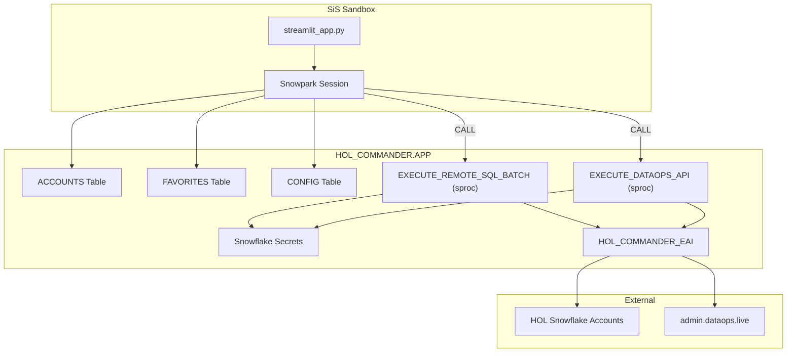

# Plan: Deploy HOL Commander to Streamlit-in-Snowflake

## Context

The HOL Commander (`app.py`, 2303 lines) manages Snowflake HOL accounts by connecting directly to each via `snowflake.connector.connect()` and calling the DataOps.live REST API via `requests`. Neither works in SiS due to sandbox restrictions.

The POC app at `/Users/cshimmin/Downloads/deploy` demonstrates the solution: push all external connectivity into stored procedures with External Access Integrations. The existing `HOL_COMMANDER` database and EAI already exist on the Sherpa account with a wildcard network rule (`*.snowflakecomputing.com:443`), so we can reuse that infrastructure and extend it.

### Key findings from POC

- `EXECUTE_REMOTE_SQL` sproc: JWT key-pair auth via REST API (`/session/v1/login-request` + `/queries/v1/query-request`)
- Uses `_snowflake.get_generic_secret_string()` for secret access
- Streamlit app uses `get_active_session()` + Snowpark SQL to call sprocs
- EAI + secrets must be declared on both the sproc AND the Streamlit object

### Existing infrastructure (Sherpa account)

- `HOL_COMMANDER` database with `APP` schema
- Network rule: `*.snowflakecomputing.com:443` (wildcard — covers all HOL accounts)
- EAI: `HOL_COMMANDER_EAI` with 5 key/passphrase secret slots
- `EXECUTE_REMOTE_SQL` sproc already exists
- `ACCOUNTS` table already exists

### Architecture



## Implementation Steps

### Step 1: Create setup.sql

Extends the existing HOL\_COMMANDER infrastructure. Key additions:

**New secrets:**

- `DATAOPS_API_TOKEN` — GitLab PAT for DataOps.live
- `HOL_PASSWORD` — default HOL password (used in password reset SQL)
- `HOL_TEMP_PASSWORD` — intermediate temp password
- `APP_PASSWORD` — app-level password gate

**New tables:**

- `FAVORITES` — replaces `~/.si_admin_favorites.json` (slug, name, created\_at)
- `CONFIG` — key-value store for app configuration

**Updated network rule** — add `admin.dataops.live:443` alongside the existing wildcard

**Updated EAI** — add new secrets to the allowed list alongside existing ones

**New stored procedures:**

- `EXECUTE_REMOTE_SQL_BATCH` — takes an account, credentials, and an ARRAY of SQL strings. Logs in once via JWT+REST, executes all statements sequentially, returns JSON array of results. Also supports a `dynamic_action` mode where it parses result rows from one statement to generate follow-up statements (for `remove_mfa_method`).
- `EXECUTE_DATAOPS_API` — proxies GET/POST calls to `admin.dataops.live`. Takes method, path, params JSON, body JSON. Returns the JSON response.

**Updated Streamlit object** — new CREATE STREAMLIT with all secret aliases and EAI

### Step 2: Create EXECUTE\_REMOTE\_SQL\_BATCH stored procedure

This is the core new sproc. The existing `EXECUTE_REMOTE_SQL` handles single statements; the batch version handles the multi-statement services that HOL Commander needs.

```
Parameters:
  ACCOUNT_ID VARCHAR
  USER_NAME VARCHAR  
  ROLE_NAME VARCHAR
  WAREHOUSE_NAME VARCHAR
  KEY_SECRET_NAME VARCHAR
  PASS_SECRET_NAME VARCHAR
  SQL_STATEMENTS VARIANT  -- JSON array of statement objects
```

Each statement object in the array:

```json
{
  "sql": "ALTER USER USER SET ...",
  "type": "execute",           // execute | dynamic | query
  "dynamic_template": null     // for dynamic: template with {name} placeholders
}
```

- `execute`: Run the SQL, return success/error
- `query`: Run the SQL, return columns + rows (for output services)
- `dynamic`: Run the SQL, iterate result rows, execute `dynamic_template` for each row (for `remove_mfa_method`)

Returns JSON:

```json
{
  "login_success": true,
  "results": [
    {"index": 0, "success": true, "columns": [...], "rows": [...], "error": null},
    {"index": 1, "success": false, "error": "message"}
  ]
}
```

### Step 3: Create EXECUTE\_DATAOPS\_API stored procedure

```
Parameters:
  METHOD VARCHAR        -- GET or POST
  PATH VARCHAR          -- e.g. /event_management/events
  PARAMS VARCHAR        -- JSON string of query params (nullable)
  BODY VARCHAR          -- JSON string of request body (nullable)
  AUTH_METHOD VARCHAR   -- 'pat' or 'bearer' (nullable, tries both if null)
```

Reads `DATAOPS_API_TOKEN` via `_snowflake.get_generic_secret_string()`.

Returns JSON with `status_code`, `body` (parsed JSON), and `auth_method` (which worked).

### Step 4: Create streamlit\_app.py

Refactor `app.py` for SiS. The bulk of changes are in the connectivity layer; UI code stays the same.

**Replacements:**

| Current (app.py)                           | SiS (streamlit\_app.py)                                             |
| ------------------------------------------ | ------------------------------------------------------------------- |
| `import snowflake.connector`               | `from snowflake.snowpark.context import get_active_session`         |
| `import requests`                          | Removed (proxied through sproc)                                     |
| `import cryptography`                      | Removed (handled in sproc)                                          |
| `st.secrets.get("HOL_PASSWORD")`           | `_snowflake.get_generic_secret_string('HOL_PASSWORD')`              |
| `st.secrets.get("APP_PASSWORD")`           | `_snowflake.get_generic_secret_string('APP_PASSWORD')`              |
| `st.secrets.get("GITLAB_API_TOKEN")`       | Read from CONFIG table or use sproc                                 |
| `DataOpsClient._get()/_post()`             | `session.sql("CALL EXECUTE_DATAOPS_API(?, ?, ?, ?, ?)")`            |
| `snowflake.connector.connect(account=...)` | `session.sql("CALL EXECUTE_REMOTE_SQL_BATCH(?, ?, ?, ?, ?, ?, ?)")` |
| `pathlib.Path.home() / "..."`              | Removed (no filesystem)                                             |
| `logging.basicConfig(filename=...)`        | `print()` statements or removed                                     |
| `load_favorites()` / `save_favorites()`    | SQL queries on `FAVORITES` table                                    |
| `_load_private_key()` from file            | Removed (sproc reads secret directly)                               |
| `_get_private_key_der()`                   | Removed (sproc handles key loading)                                 |

**DataOpsClient rewrite:**

The `DataOpsClient` class (\~120 lines) gets rewritten to proxy through the sproc:

```python
class DataOpsClient:
    def __init__(self, session):
        self.session = session
        self.auth_method = None
    
    def _call_api(self, method, path, params=None, body=None):
        result = self.session.sql(
            "CALL HOL_COMMANDER.APP.EXECUTE_DATAOPS_API(?, ?, ?, ?, ?)",
            params=[method, path, json.dumps(params) if params else None,
                    json.dumps(body) if body else None, self.auth_method]
        ).collect()
        data = json.loads(result[0][0])
        if data.get("auth_method"):
            self.auth_method = data["auth_method"]
        if data.get("error"):
            raise RuntimeError(data["error"])
        return data["body"]
    
    def _get(self, path, params=None):
        return self._call_api("GET", path, params)
    
    def _post(self, path, json_data=None, params=None):
        return self._call_api("POST", path, params, json_data)
    
    # All existing methods (get_events, get_event_accounts, etc.) stay the same
    # since they delegate to _get/_post
```

**\_run\_services\_core rewrite:**

The core execution function (\~100 lines) changes from direct connector usage to sproc calls:

```python
def _run_services_core(account, service_configs, session, api_client=None, event_slug=None):
    # API actions — same as before but using proxied client
    for svc_key, cfg in api_configs.items():
        # ... same logic, client already proxied ...
    
    # SQL services — build statement array, call batch sproc
    if sql_configs:
        statements = []
        for svc_key, cfg in sql_configs.items():
            if cfg["service_type"] == "dynamic_action":
                statements.append({
                    "sql": cfg["show_sql"],  # e.g. SHOW MFA METHODS FOR USER X
                    "type": "dynamic",
                    "dynamic_template": cfg["alter_template"],
                    "service_key": svc_key,
                })
            else:
                for stmt in cfg.get("statements", []):
                    statements.append({
                        "sql": stmt,
                        "type": "query" if cfg.get("output_column") else "execute",
                        "service_key": svc_key,
                    })
        
        result_json = session.sql(
            "CALL HOL_COMMANDER.APP.EXECUTE_REMOTE_SQL_BATCH(?, ?, ?, ?, ?, ?, ?)",
            params=[
                account["conn_account"],
                "EMERGENCY_SERVICE_USER",
                "ACCOUNTADMIN",
                "COMPUTE_WH",
                "HOL_PRIVATE_KEY",
                None,  # no passphrase
                json.dumps(statements),
            ]
        ).collect()
        
        # Parse results back into per-service result dicts
        batch_results = json.loads(result_json[0][0])
        # ... map results back to service_key ...
```

**Parallel execution:**

Threads still work in SiS — each thread calls sprocs via its own `session.sql()`. The `get_active_session()` is thread-safe when wrapped properly. We'll keep `ThreadPoolExecutor` but pass the session object.

**Password mode removal:**

In SiS, we only support key-pair auth (the whole point of the REST API approach). The password auth mode UI can be hidden/removed since `snowflake.connector.connect()` with password isn't available.

### Step 5: Create environment.yml

```yaml
name: sf_env
channels:
  - snowflake
dependencies:
  - snowflake-snowpark-python
  - pandas
```

### Step 6: Deploy and test

1. Run `setup.sql` to create/update all objects
2. Populate secrets with real values (private key PEM, DataOps token, passwords)
3. PUT files to stage
4. Create Streamlit object
5. Test: load events, select accounts, execute a simple service
6. Debug network rule / EAI issues if they arise

## Verification

- Open the SiS app in Snowsight
- Verify DataOps API connection (event listing loads)
- Select a test event with 1-2 accounts
- Run "Get account locator" service (simple SELECT query)
- Run "Disable MFA temporarily" (multi-statement action)
- Run "Remove MFA methods" (dynamic action)
- Verify parallel execution with 3+ accounts
- Verify favorites persistence across page refreshes

## Critical Files

- app.py — Source of the refactoring; all UI code, service definitions, execution engine
- [/Users/cshimmin/Downloads/deploy/setup.sql](<> "file:///Users/cshimmin/Downloads/deploy/setup.sql") — POC infrastructure pattern to follow for stored procedures and EAI setup
- [/Users/cshimmin/Downloads/deploy/streamlit\_app.py](<> "file:///Users/cshimmin/Downloads/deploy/streamlit_app.py") — POC Streamlit patterns (get\_active\_session, sproc calls, rerun helper)
- setup.sql (to be created) — All DDL for the SiS deployment
- streamlit\_app.py (to be created) — Refactored app for SiS
